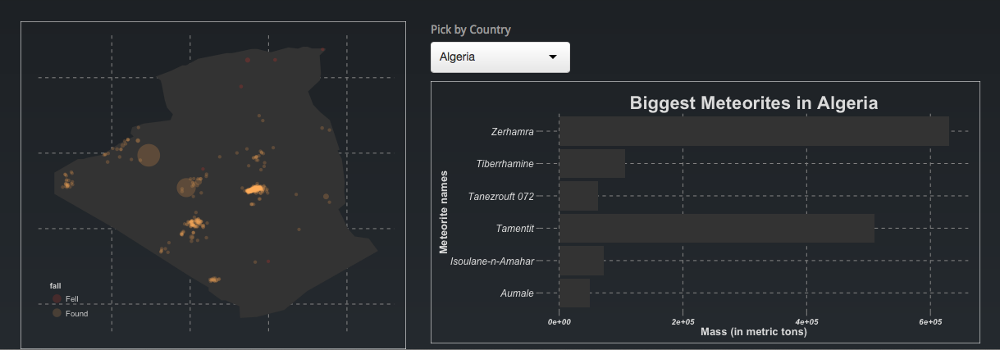

Final Project
==============================

| **Name**  | Anuj Saxena  |
|----------:|:-------------|
| **Email** | asaxena2@dons.usfca.edu |

## Discussion ##

Hello, welcome to the repository of my final data visualization project. Kindly make sure to install the following packages:

```
library(shiny)
library(ggplot2)
library(maps)
library(stringr)
library(gridExtra)
```

Thank you!

To view my shiny app, run the following code in R.

```
shiny::runGitHub('msan622', 'anujsaxenaa', subdir='final-project')
```

Make sure that you are connected to the internet as there the theme functionality is taken from a website.
##Overview
The dataset that I used for my final project is of Meteorite Landings provided for free online by the Meteoritical Society. Over the past decade, this field has received major international attention. It has even been said that meteorite landings have become more common in recent years and scientist all over the world are eager to learn what mysteries of the universe in presented on their doorstep. Billions of dollars of fundings is being put into action by space research associations of all major countries such as USA, Russia, France etc. With this in mind, this dataset provides us with interesting insights as to how the history of meteorite landings has happened on earth. 

To add to that, this dataset has been acclaimed to be a terrific prototype for a cool data visualization exercise.  
And being the spatially intelligent dominant person that I am, I was fascinated by the prospects of this dataset. I initially did not have any concrete plan of actions for going about this task, but I was motivated nonetheless. Visualizing.org also hosted a visualization competition on this dataset. Even though competitors used fancy javascript skills, I planned to use the power of R, ggplot2, shiny to the max. For more information, visit the following link :- http://www.visualizing.org/contests/visualizing-meteorites

I found that my data was heavily negatively skewed. i.e. I had more meteorite landings in recent years than in earlier years. Hence I 
## 1. History of Meteorite Landings##

Techniques:

The first thought that came to my mind was pretty obvious. I wanted to visualize how the meteorites landed on earth. This was easier said than done as I faced many issues that made me compromise on my idea. 
For achieving the most, I used the combination of ```time series``` and ```geospatial mapping``` techniques. 
These two techniques were helpful and were the main basis of my visualization. Since there was a vast range in the mass values of meteorites, I decided to scale sizes using ```scale_size``` to be between (2,13). This way I could control the data density and be able to display all points nicely. I used an ```alpha``` level of 0.6 so for maintaining a good data ink ratio and make the map look less dense. I colored the meteorites based on the two kind that there were, namely that were ```Found``` or ```Fell```. Found meteorites are found on the year reported and fell meteorites are reported to be seen falling in that reported year. I started my timeline from 1600 to 2013 as there were few observations that were far in between each other before 1600.

The main takeaway in this visual is to not only see how the distribution of the meteorite landings happened, but also notice where both the ```Fall``` and ```Fell``` meteorites landed over history. After plotting the graph, one can easily make out a certain pattern in the distribution between these two. On getting inference from the information presented, I was able to come up with some hypothesis. For example, there are more ```Fell``` meteorites in geographic locations with more populations on average from 1600-2013. i.e. there were always people present for reporting (and more possibly documenting) a live meteor crash landing. ```Found``` meteorites on the other hand appear more at colonized locations, where meteorologists later on found fallen meteorites. 

Interactivity:
For interactivity, I used the ```sliderInput``` function of ```shinyUI```. I implemented the ```animate``` function that enables me to automatically see the changes in my map over time. I looked at the changes happening on a decade level by setting the ```step``` as 10 years.


## 2. Distribution and Location of Found & Fell meteorites
Histogram:

Techniques: This plot shows the distribution of ```Fell``` and ```Found``` meteorites over time. I used ```geom_histogram``` with a ```bin``` size of one to looks at the granularity of the distribution. From the plot, we can see that for both ```Found``` & ```Fell``` meteorites, the distribution appears to be negatively skewed, i.e. more observations are from the recent years than in earlier years. The skew for ```Found``` meteorites is severely negative. One reason could be because more than 99% of all the meteorites in Antarctica were found after 1970. Antarctica is a hub for meteorite landings with about 20,000 reports occurring there alone. The uninhabited and untapped nature of the continent might have played a factor in preserving the history of meteorite landings. To add to that, even for ```Fell``` meteorites the occurrences have been more in recent years. The underlying reasons could be either that more meteorites have been crashed in recent times or that meteor detecting has become more advanced and efficient. To view the granularity of the distribution, I set the ```binwidth``` to 1. The ```Fell``` histogram is inverted to represent the meteorites falling.

Interactivity:
I added a ```sliderInput``` which can highlight on the histogram the range of years that we want to provide. This works over any range of years that we are interested in looking at. The ```sliderInput``` is also used for the next visualization as well.


Orthogonal Maps:
Techniques: This plot is very useful if seen alongside the previous histogram as it provides the location parameter. I used the ```coord_map()``` functionality in ```ggplot``` to get a orthogonal map and selected the below four orientations that pretty much the entire globe. From this visual, we can see how filtering by year subsets the points on the map to show only a selected time frame in history. The Antarctica example that I mentioned above can be clearly inferred from this visualization. To have good data density, I scaled the sizes of the points using ```scale_size``` to be between (2,13). I choose ```alpha``` to be 1/6 for maintaining a good data ink ratio. 

Interactivity:
The interval ```sliderInput``` is used in this plot to highlight only those observations that are within the given time frame. 


## 3. Looking at Each Country
Techniques: With abundant observation points at my disposal, I decided to look more close by viewing the country level meteorite landings. I created the country column using the ```map.where``` function to map the meteorite coordinates to the right country. I used ```geom_polygon``` function and used latitude and longitude coordinates for each country. With this, I could now plot individual countries and get a zoomed in view of meteorite landing in each country. 

Interactivity: I used the ```selectInput``` function from the ```shinyUI``` to select a particular country. 

## 4. Country-level statistics 
Techniques: In this plot, I show the top 5 meteorites (with names) with regards to mass for each country. I used ```geom_bar``` and ```coord_flip``` to achieve the plot orientation. My plot function creates a new data frame on the top 5 meteorites every time I change the country. This additional heuristic along with the the country plot gives us a brief summary and understanding of meteorite landings for each individual country.

Interactivity: The interactivity uses the ```selectInput``` function that changes the bar graph alongside the country graph.



## Changes after the prototype feedback

## Challenges
