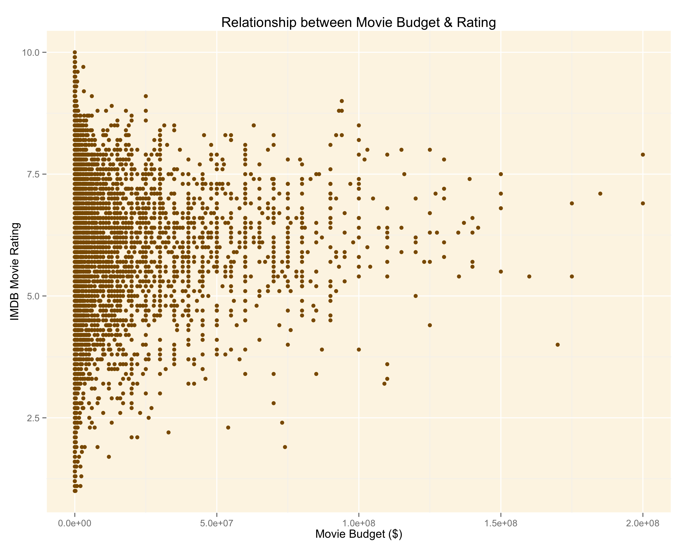
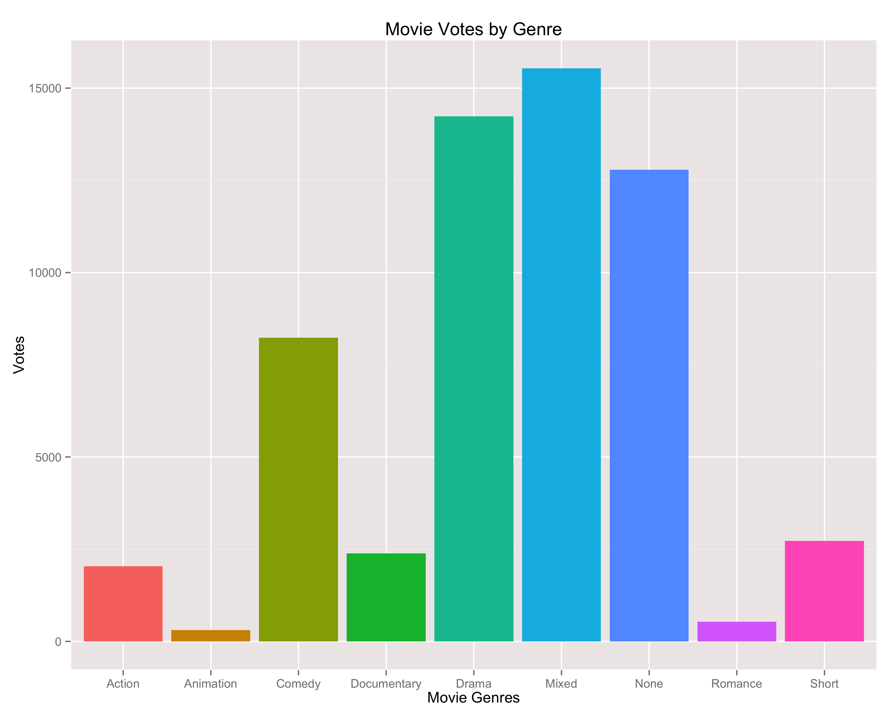
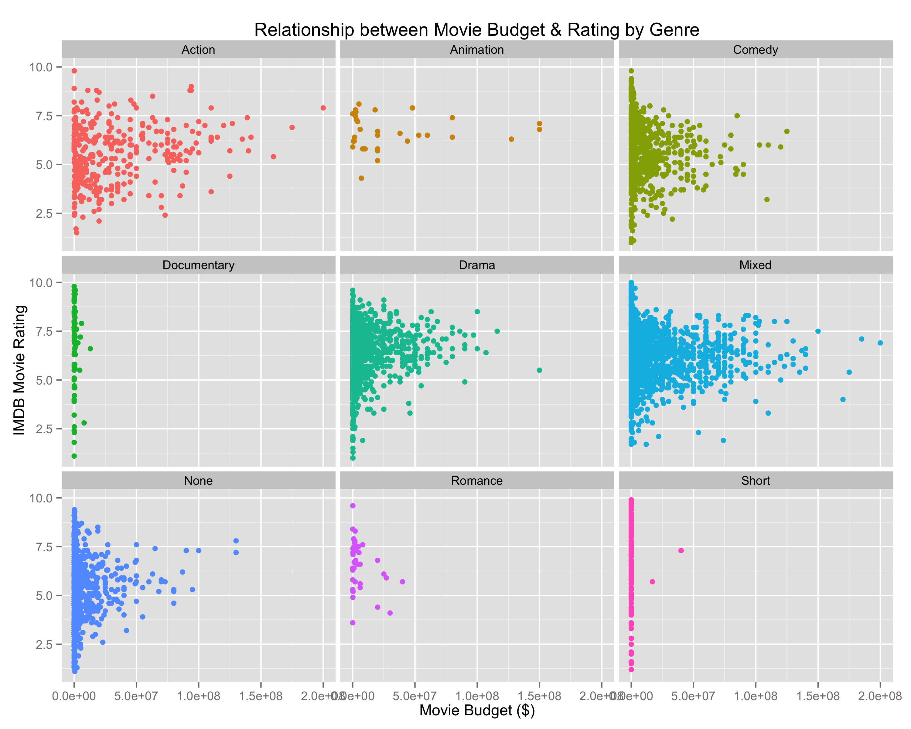

Homework 1: Basic Charts
==============================

| **Name**  | Anuj Saxena  |
|----------:|:-------------|
| **Email** | asaxena2@dons.usfca.edu |

## Instructions ##

The following packages must be installed prior to running this code:

- `ggplot2`
- `devtools`
- `plyr`

To run this code, please enter the following commands in R:

```
library(devtools)
source_url("https://raw.github.com/anujsaxenaa/msan622/template/homework1/Homework.R")
```

This will generate 4 images. The images are shown below.


## Plots ##

1)

I tried a different ggplot background than the default ggplot2. Not bad. 
 
2)


3)


I decided to remove the legend because I felt it was redundant information on the graph. I'm guessing it's self evident from the figure itself which facet
corresponds to which genre of movie.

4)


