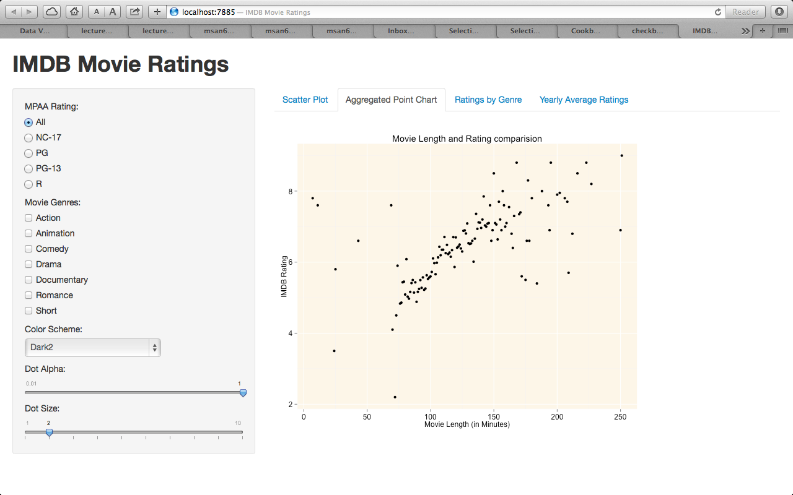
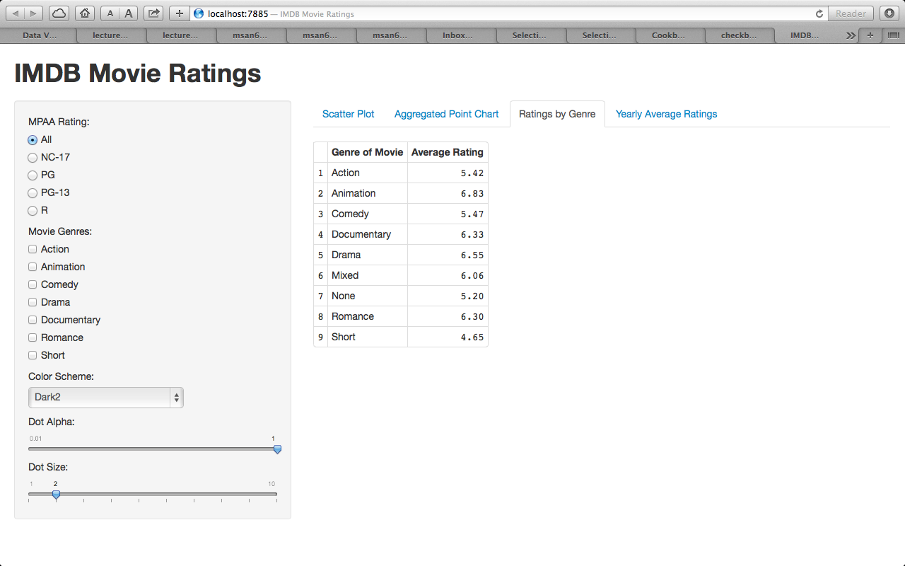
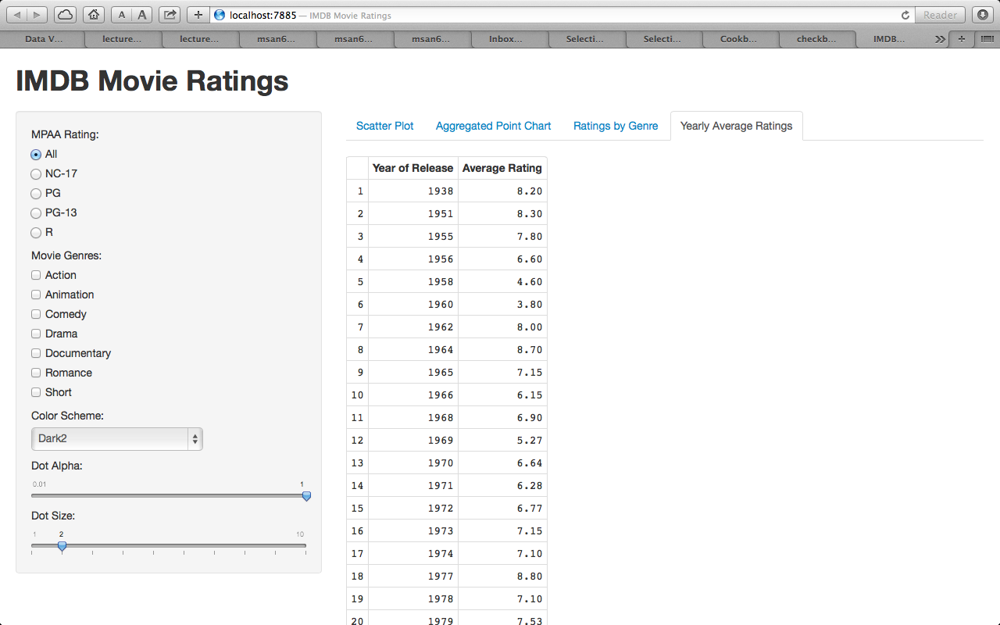

Homework 2: Interactivity
==============================

| **Name**  | Anuj Saxena  |
|----------:|:-------------|
| **Email** | asaxena2@dons.usfca.edu |

## Instructions ##

The following packages must be installed prior to running this code:

- `ggplot2`
- `shiny`

To run this code, please enter the following commands in R:

```
library(shiny)
shiny::runGitHub('msan622', 'anujsaxenaa', 'homework2')
```

This will start the `shiny` app. See below for details on how to interact with the visualization.

## Discussion ##

##Aggregated Point Chart##

I was interested in know if the length of the Movie has a relationship with the IMDB rating. I aggregated the data on the length of the movie and plotted a scatter plot to see the relationship. I found there to be a positive correlation between the Ratings and Movie length. 

##Ratings by Genre##

I was interested in looking at average IMDB ratings by specific Genre. The table gives me information in a short concise manner.

##Yearly Average Ratings##

I created a Yearly sorted table of the Year of release and the Average ratings in that year. I aggressed the table by yearly basis.
