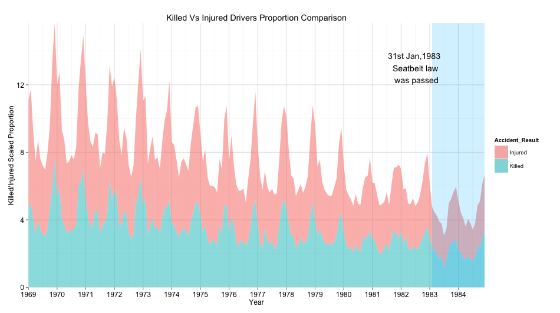
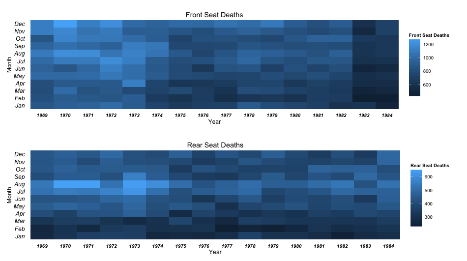
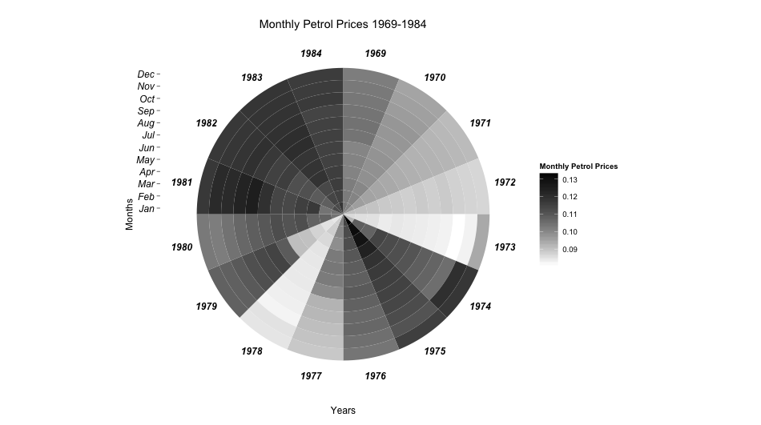

Homework 5: Time Series Visualization
==============================

| **Name**  | Anuj Saxena  |
|----------:|:-------------|
| **Email** | asaxena2@dons.usfca.edu |

## Instructions ##

Please install the following packages.

- `ggplot2`

- `scales`

- `gridExtra`

## Discussion ##

##Stacked Area Plot##

For this graph, I wanted to look at whether there was any change in the accident behavior
with respect to the drivers. I divided both the drivers killed and drivers injured by their
standard deviations in order to show their proportions. I further normalized the statistics with the distance 'kms'
measure to get a fair heuristic. I wanted to visually answer two questions from this 
visualization:
1) Has the law been successful in reducing the deaths and injuries ?
2) Has the death portion reduced ? As seat belts can play an important role in changing a 'driver killed' statistic
to a 'driver injured' statistic.

##Heat Map##

I was interested in visually finding the trends for the death of front and rear seat passengers. I used `geom_rect()` to
create a heatmap for finding this out. From the plot, we surely see a pattern for the front seat passenger deaths as they
have significantly decreased over time. If we look closely, after jan 31st, 1983, right after the seat belt law was passed,
we see a significant drop in the number of front seat deaths. This also confirms a common notion that seat belts are more
influential on front seat passengers.

##Polar Coordinates HeatMap or Circular View Plot##

Apart from the accident statistics, I was interested in looking at how the petrol prices changed over different months and
also over different years. The plot successfully gives us this information. I used the gray scale because it gave me
a good variation of palettes to work with, keeping the ink-ratio at a good level.