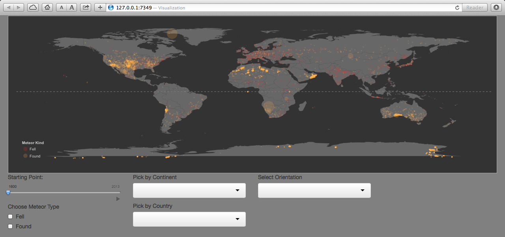
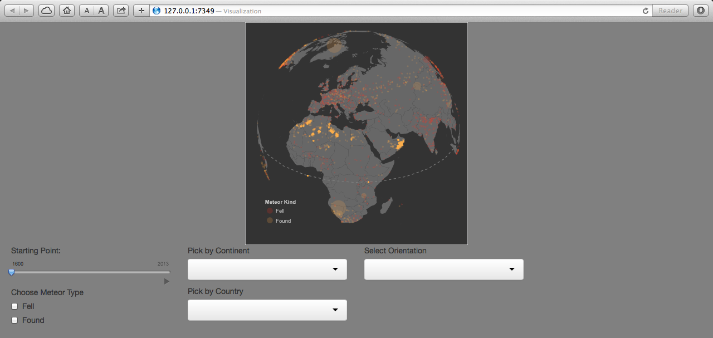

Project: Prototype
==============================

| **Name**  | Anuj Saxena  |
|----------:|:-------------|
| **Email** | asaxena2@dons.usfca.edu |

## Discussion ##

The data set I'm using for my project is the Meteorite Landings data set. The data set has the following columns:

- Name of the Meteorite (generally goes after the place it landed).

- Meteor Class.

- Mass (in metric tons).

- Fell or Found.

- Year.

- Id.

- Location Latitude.

- Location Longitude.

- Country (self-generated)

The dataset contains data of all known meteor landings in earths history. There was some missing data
where full records were not present and important fields such as mass, longitudes, latitudes were missing.
Therefore, I decided to look at the landings that were after 1600 A.D. and still had close to 35,000 rows of
data. 

Below is the screenshot of my prototype interface:

##Choose Meteor Type##
This will allow me to filter meteors that were found or fell at the year it was recorded.

##Pick by Continent##
This will allow me to zoom into different continents and give me more information about the 
general spread of meteor landing across all the countries in that continent.

##Pick by County##
This will allow me to zoom into a specific country and get info on the biggest meteors that landed,
their type, year etc.

##Select Point##
This will let me play the scenario of meteor landings as it happened over history starting from 1600 to 2013.

##Select Orientation##
This gives me a alternate ways to look at the map of the world as demonstrated in an example below.

