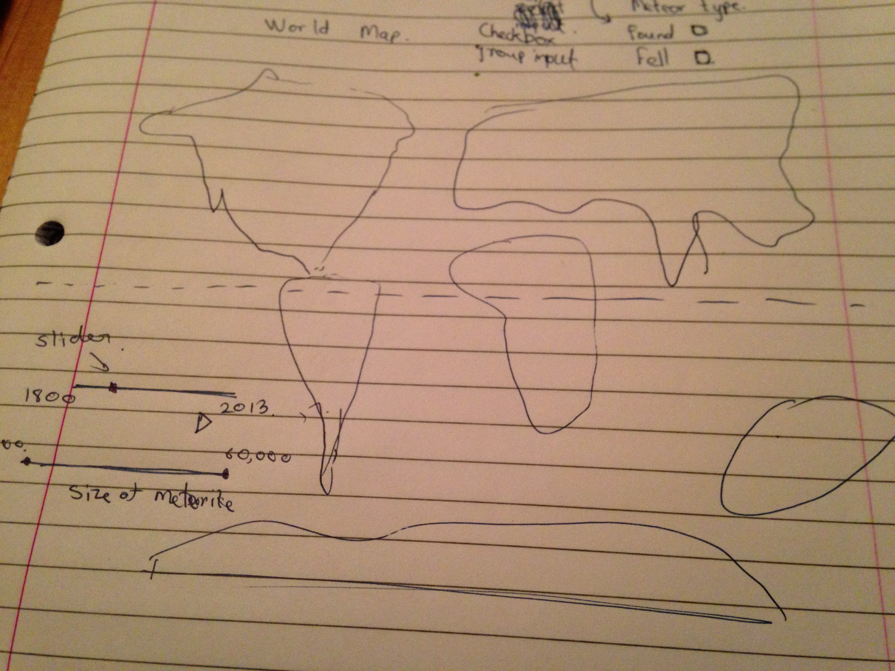

Project: Sketch
==============================

| **Name**  | Anuj Saxena  |
|----------:|:-------------|
| **Email** | asaxena2@dons.usfca.edu |

## Discussion ##

I was interested in doing some geospatial mapping for the final project. My dataset for the project is
about the meteorite landings over history. 
I'm planning to implement most of the following packages for my final project visualization.

-`shiny`

-`scales`

-`ggplot2`

-`rdgal`

-`rCharts`


The following is the rough layout of my visualization


Slider Panel for the years:
My main goal is to try to show how the meteorite landings happened over time. This is why I'll
be using ```animationOptions``` in 	```sliderInput```. Using the year slider, I want to show these landings
over time. 

CheckBoxGroupInput: I will use this to filter my data to view different kinds of meteorites. Fall and Found are the 
types of meteorites defined in the dataset. Using Filtering to view these would tell us where people more often find
meteorites that have already landed or spot meteorites that are falling at that given point of time. 
The CheckBoxGroupInput would simply help me try to answer these questions visually and check if there is a pattern or not.

Slider panel for the meteorite sizes:
I would be defining meteors as points whose size would represent the size of that meteorite. 
Using the slider panel, I want to show where certain sized meteors landed over time.

The above would be pertaining to a world map as shown above. Besides this, I'll be showing other plots 
like bubble plot, histograms
Bubble plot: X axis: Year, Y axis: Mass of the meteorite.

If successful, I'll try to use brushing techniques that involve hovering over the histogram and seeing changes 
in other plots.